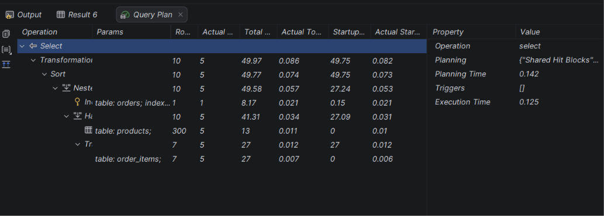

## Structure
- Function: Calculate Order Total in [calculate_order_total_function.sql](calculate_order_total_function.sql)
- Procedure: Create New Order in [create_new_order_procedure.sql](create_new_order_procedure.sql)
- Procedure: Add Product to Order in [add_product_to_order_procedure.sql](add_product_to_order_procedure.sql)
- Trigger: Update Order Total in [update_order_total_trigger.sql](update_order_total_trigger.sql)
- Trigger: Order Audit Log in [order_audit_trigger.sql](order_audit_trigger.sql)
- Testing in [testing.sql](testing.sql)

## Explain analyze

PostgreSQL plan how it will execute the query. 
Backend check if necessary permissions is had, after rewrites SQL query to more low-code query, optimizes it and execute. 
Index Scan is used when index tables are available, Sequential Scan when not.
Hash Join is used when indexes are not exists. It is works by creating hash table for smaller table.
Nested Loop is used for small tables when PostgreSQL just join by going through all rows.